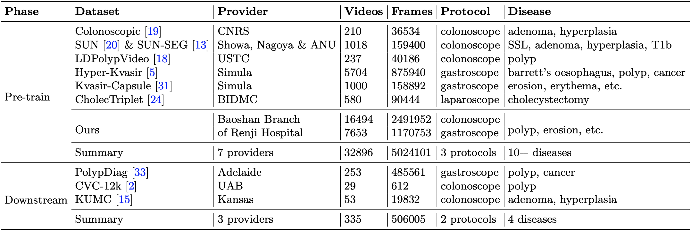

# Foundation Model for Endoscopy Video Analysis
<!-- select Model and/or Data and/or Code as needed>
### Welcome to OpenMEDLab! 👋

<!--
**Here are some ideas to get you started:**
🙋‍♀️ A short introduction - what is your organization all about?
🌈 Contribution guidelines - how can the community get involved?
👩‍💻 Useful resources - where can the community find your docs? Is there anything else the community should know?
🍿 Fun facts - what does your team eat for breakfast?
🧙 Remember, you can do mighty things with the power of [Markdown](https://docs.github.com/github/writing-on-github/getting-started-with-writing-and-formatting-on-github/basic-writing-and-formatting-syntax)
-->


<!-- Insert the project banner here -->

[//]: # (<div align="center">)

[//]: # (    <a href="https://"></a>)

[//]: # (</div>)

[//]: # (---)

<!-- Select some of the point info, feel free to delete -->

[//]: # ([![Twitter]&#40;https://img.shields.io/twitter/url?style=social&url=https%3A%2F%2Ftwitter.com%2Fopendilab&#41;]&#40;https://twitter.com/opendilab&#41;)

[//]: # ([![PyPI]&#40;https://img.shields.io/pypi/v/DI-engine&#41;]&#40;https://pypi.org/project/DI-engine/&#41;)

[//]: # (![Conda]&#40;https://anaconda.org/opendilab/di-engine/badges/version.svg&#41;)

[//]: # (![Conda update]&#40;https://anaconda.org/opendilab/di-engine/badges/latest_release_date.svg&#41;)

[//]: # (![PyPI - Python Version]&#40;https://img.shields.io/pypi/pyversions/DI-engine&#41;)

[//]: # (![PyTorch Version]&#40;https://img.shields.io/badge/dynamic/json?color=blue&label=pytorch&query=%24.pytorchVersion&url=https%3A%2F%2Fgist.githubusercontent.com/PaParaZz1/54c5c44eeb94734e276b2ed5770eba8d/raw/85b94a54933a9369f8843cc2cea3546152a75661/badges.json&#41;)

[//]: # ()
[//]: # ()
[//]: # (![Loc]&#40;https://img.shields.io/endpoint?url=https://gist.githubusercontent.com/HansBug/3690cccd811e4c5f771075c2f785c7bb/raw/loc.json&#41;)

[//]: # (![Comments]&#40;https://img.shields.io/endpoint?url=https://gist.githubusercontent.com/HansBug/3690cccd811e4c5f771075c2f785c7bb/raw/comments.json&#41;)

[//]: # ()
[//]: # (![Style]&#40;https://github.com/opendilab/DI-engine/actions/workflows/style.yml/badge.svg&#41;)

[//]: # (![Docs]&#40;https://github.com/opendilab/DI-engine/actions/workflows/doc.yml/badge.svg&#41;)

[//]: # (![Unittest]&#40;https://github.com/opendilab/DI-engine/actions/workflows/unit_test.yml/badge.svg&#41;)

[//]: # (![Algotest]&#40;https://github.com/opendilab/DI-engine/actions/workflows/algo_test.yml/badge.svg&#41;)

[//]: # (![deploy]&#40;https://github.com/opendilab/DI-engine/actions/workflows/deploy.yml/badge.svg&#41;)

[//]: # ([![codecov]&#40;https://codecov.io/gh/opendilab/DI-engine/branch/main/graph/badge.svg?token=B0Q15JI301&#41;]&#40;https://codecov.io/gh/opendilab/DI-engine&#41;)

[//]: # ()
[//]: # (![GitHub Org's stars]&#40;https://img.shields.io/github/stars/opendilab&#41;)

[//]: # ([![GitHub stars]&#40;https://img.shields.io/github/stars/opendilab/DI-engine&#41;]&#40;https://github.com/Med-AIR/Endo-FM/stargazers&#41;)

[//]: # ([![GitHub forks]&#40;https://img.shields.io/github/forks/opendilab/DI-engine&#41;]&#40;https://github.com/Med-AIR/Endo-FM/network&#41;)

[//]: # (![GitHub commit activity]&#40;https://img.shields.io/github/commit-activity/m/opendilab/DI-engine&#41;)

[//]: # ([![GitHub issues]&#40;https://img.shields.io/github/issues/opendilab/DI-engine&#41;]&#40;https://github.com/opendilab/DI-engine/issues&#41;)

[//]: # ([![GitHub pulls]&#40;https://img.shields.io/github/issues-pr/opendilab/DI-engine&#41;]&#40;https://github.com/opendilab/DI-engine/pulls&#41;)

[//]: # ([![Contributors]&#40;https://img.shields.io/github/contributors/opendilab/DI-engine&#41;]&#40;https://github.com/opendilab/DI-engine/graphs/contributors&#41;)

[//]: # ([![GitHub license]&#40;https://img.shields.io/github/license/opendilab/DI-engine&#41;]&#40;https://github.com/Med-AIR/Endo-FM/blob/master/LICENSE&#41;)

[//]: # (Updated on 2023.06.09)


This repository provides the official PyTorch implementation of the paper [**Foundation Model for Endoscopy Video Analysis via Large-scale Self-supervised Pre-train**](TBA)
by [Zhao Wang](https://kyfafyd.wang)\*, Chang Liu\*, [Shaoting Zhang](http://www.qingyuan.sjtu.edu.cn/a/Shaoting-Zhang.html)†, and [Qi Dou](http://www.cse.cuhk.edu.hk/~qdou)†.

<div align="center">
    <a href="https://"></a>
</div>

## Key Features


[//]: # (key feature bulletin points here)
- First foundation model for endoscopy video analysis.
- A large-scale endoscopic video dataset with over 32k video clips.
- Support 3 types of downstream tasks, including classification, segmentation, and detection.

## Links

- [Paper](TBA)
- [Model](https://mycuhk-my.sharepoint.com/:u:/g/personal/1155167044_link_cuhk_edu_hk/EZh5mWE5CL1BpaJ1bXuokfYBDM2VaMknqG7YpaQBRgAvdQ?e=e2rVYW)
- [Code](https://github.com/med-air/Endo-FM) 
<!-- [Code] may link to your project at your institute>


<!-- give a introduction of your project -->

## Details

> Recent foundation models have exhibited remarkable success in various downstream tasks, such as disease diagnosis and report generation. However, a foundation model for endoscopic videos is lacking. In this paper, we propose Endo-FM, a foundation model specifically designed for endoscopic video analysis. First, we build a video transformer as Endo-FM, which captures both local and global long-range dependencies across spatial and temporal dimensions. Second, we pre-train our Endo-FM using global and local views to be robust to spatial-temporal changes and discriminative across different videos. To achieve this, we construct a large-scale endoscopy video dataset by combining all publicly available datasets and a new private one. This dataset consists of over 33K video clips (5M frames), encompassing varying modalities, target organs, and disease types. Our pre-trained Endo-FM achieves promising performance on downstream tasks, surpassing state-of-the-art methods by a significant margin.

<!-- Insert a pipeline of your algorithm here if got one -->


[//]: # (More intro text here.)


## Datasets

<div align="center">
    <a href="https://"></a>
</div>

<div align="center">
    <a href="https://"></a>
</div>

We utilize 6 public and 1 private datasets for pre-training and 3 datasets as the downstream tasks.
Except for SUN-SEG, we provide our preprocessed data for pre-training and downstream tasks.

#### Pre-training Data (6 public + 1 private) 
- Colonoscopic [[original paper]](https://ieeexplore.ieee.org/abstract/document/7442848) [[original dataset]](http://www.depeca.uah.es/colonoscopy_dataset/)  [[our preprocessed dataset]](https://mycuhk-my.sharepoint.com/:f:/g/personal/1155167044_link_cuhk_edu_hk/EjX1xmuzLxhDgC2XFOuQm6YBymcSx0kcKRK0WJ5aLeZkZg?e=eaWcGW)
- SUN-SEG [[original paper]](https://link.springer.com/article/10.1007/s11633-022-1371-y) [[original dataset]](https://github.com/GewelsJI/VPS/blob/main/docs/DATA_PREPARATION.md)
- LPPolypVideo [[original paper]](https://link.springer.com/chapter/10.1007/978-3-030-87240-3_37) [[original dataset]](https://github.com/dashishi/LDPolypVideo-Benchmark) [[our preprocessed dataset]](https://mycuhk-my.sharepoint.com/:f:/g/personal/1155167044_link_cuhk_edu_hk/EqyUhxD1a_JEmkJBzY3axqkBYRRQsJqgmF5p-pgh0LUQSg?e=vi9FU0)
- Hyper-Kvasir [[original paper]](https://www.nature.com/articles/s41597-020-00622-y) [[original dataset]](https://datasets.simula.no/hyper-kvasir/) [[our preprocessed dataset]](https://mycuhk-my.sharepoint.com/:f:/g/personal/1155167044_link_cuhk_edu_hk/EoO0sysq_URMq_cm5P-R-B4BqBDoXIsfL3NlupsBZyfW3A?e=VBDcwc)
- Kvasir-Capsule [[original paper]](https://www.nature.com/articles/s41597-021-00920-z) [[original dataset]](https://datasets.simula.no/kvasir-capsule/) [[our preprocessed dataset]](https://mycuhk-my.sharepoint.com/:f:/g/personal/1155167044_link_cuhk_edu_hk/EuqOhvyl9O5OggzsMIh3Xq4B1YIUZFNe25MnWNp3WCk1KQ?e=QApSVj)
- CholecTriplet [[original paper]](https://www.sciencedirect.com/science/article/pii/S1361841522000846) [[original dataset]](https://cholectriplet2021.grand-challenge.org/) [[our preprocessed dataset]](https://mycuhk-my.sharepoint.com/:f:/g/personal/1155167044_link_cuhk_edu_hk/EgELubRL21ZMlthpwHIJyZgB7cx9yTbjJoWuZ14gyhK0Qw?e=ahZAcI)
- Our Private [[our preprocessed dataset]](https://mycuhk-my.sharepoint.com/:f:/g/personal/1155167044_link_cuhk_edu_hk/EmJYfUuzesNFjenQwnZe3osB2FSdKnvGSLlp87uhDTt1Ow?e=xoCEbi)

#### Downstream Data (3 public)
- PolypDiag [[original paper]](https://link.springer.com/chapter/10.1007/978-3-031-16437-8_9) [[original dataset]](https://github.com/tianyu0207/weakly-polyp) [[our preprocessed dataset]](https://mycuhk-my.sharepoint.com/:f:/g/personal/1155167044_link_cuhk_edu_hk/EkdIvYn0AltHkeIEF3Os8fsBhGvyyuJ2QuupJ8aoqkN_Pw?e=vv0TDc)
- CVC-12k [[original paper]](https://www.sciencedirect.com/science/article/pii/S0895611115000567) [[original dataset]](https://polyp.grand-challenge.org/Databases/) [[our preprocessed dataset]](https://mycuhk-my.sharepoint.com/:f:/g/personal/1155167044_link_cuhk_edu_hk/EiztownKIUNPjOV48ERuL5EBfn6KzgVUY1O4dxn1HdmlBg?e=8fq86m)
- KUMC [[original paper]](https://journals.plos.org/plosone/article?id=10.1371/journal.pone.0255809) [[original dataset]](https://dataverse.harvard.edu/dataset.xhtml?persistentId=doi:10.7910/DVN/FCBUOR) [[our preprocessed dataset]](https://mycuhk-my.sharepoint.com/:f:/g/personal/1155167044_link_cuhk_edu_hk/EuhFE9IsVHlKtsTMHMCib4oBN19pH4DSr4esxoMOSQTUEA?e=f1sk0k)


For SUN-SEG, you need first request the original videos following [this instruction](https://github.com/GewelsJI/VPS/blob/main/docs/DATA_PREPARATION.md).
Then, you can transfer SUN-SEG for pre-training videos by the following:
```bash
cd Endo-FM/data
python sun.py
python sun_seg.py
python trans_videos_pretrain.py
```
Finally, generating the video list `pretrain/train.csv` for pre-training by the following:
```bash
cd Endo-FM/data
python gencsv.py
```


## Get Started

#### Main Requirements
- torch==1.8.0
- torchvision==0.9.0
- pillow==6.2.2
- timm==0.4.12

#### Installation
We suggest using Anaconda to setup environment on Linux, if you have installed anaconda, you can skip this step.

```shell
wget https://repo.anaconda.com/archive/Anaconda3-2020.11-Linux-x86_64.sh && zsh Anaconda3-2020.11-Linux-x86_64.sh
```

Then, we can install packages using provided `environment.yaml`.

```shell
cd Endo-FM
conda env create -f environment.yaml
conda activate endofm
```

#### Pre-trained Weights
You can directly download our pre-trained Endo-FM via this [link](https://mycuhk-my.sharepoint.com/:u:/g/personal/1155167044_link_cuhk_edu_hk/EZh5mWE5CL1BpaJ1bXuokfYBDM2VaMknqG7YpaQBRgAvdQ?e=e2rVYW) and put it under `checkpoints/` for downstream fine-tuning.

#### Downstream Fine-tuned Weights
Also, we provide the pre-trained weights of 3 downstream tasks for direct downstream testing.

|    Dataset    | PolypDiag | CVC-12k | KUMC | 
|:--------------:|:----:|:----:|:-----:|
|    Our Paper   | 90.7 | 73.9 | 84.1 |
| Released Model | 91.3 | 76.6 | 84.0 |
| Weights | [link](https://mycuhk-my.sharepoint.com/:u:/g/personal/1155167044_link_cuhk_edu_hk/ERSlUP10MGpBuhg1uN5iaHABKqz1SPQSrr03j4sEWey-bw?e=muv8RL) | [link](https://mycuhk-my.sharepoint.com/:u:/g/personal/1155167044_link_cuhk_edu_hk/EePnpTllUCFEqpYp6BFPv0sBQyST4CV4jQ8pvaRynCkD7Q?e=f7LeBx) | [link](https://mycuhk-my.sharepoint.com/:u:/g/personal/1155167044_link_cuhk_edu_hk/EYPkwbFyMfxEirezWtumAGIBSCTQ0EvDN4u99KKiRsaVBA?e=DsrkVG) |

<!-- [//]: # (#### Preprocess) -->


#### Pre-training
```shell
cd Endo-FM
wget -P checkpoints/ https://github.com/kahnchana/svt/releases/download/v1.0/kinetics400_vitb_ssl.pth
bash scripts/train_clips32k.sh
```

#### Downstream Fine-tuning
```shell
# PolypDiag (Classification)
cd Endo-FM
bash scripts/eval_finetune_polypdiag.sh

# CVC (Segmentation)
cd Endo-FM/TransUNet
python train.py

# KUMC (Detection)
cd Endo-FM/STMT
python setup.py build develop
python -m torch.distributed.launch \
    --nproc_per_node=1 \
    tools/train_net.py \
    --master_port=$((RANDOM + 10000)) \
    --config-file configs/STFT/kumc_R_50_STFT.yaml \
    OUTPUT_DIR log_dir/kumc_finetune
```

#### Direct Downstream Testing
```shell
# PolypDiag (Classification)
cd Endo-FM
bash scripts/test_finetune_polypdiag.sh

# CVC (Segmentation)
cd Endo-FM/TransUNet
python train.py --test

# KUMC (Detection)
cd Endo-FM/STMT
python setup.py build develop
python -m torch.distributed.launch \
    --nproc_per_node=1 \
    tools/test_net.py \
    --master_port=$((RANDOM + 10000)) \
    --config-file configs/STFT/kumc_R_50_STFT.yaml \
    MODEL.WEIGHT kumc.pth \
    OUTPUT_DIR log_dir/kumc_finetune
```

## 🙋‍♀️ Feedback and Contact

For further questions, pls feel free to contact [Zhao Wang](mailto:zwang21@cse.cuhk.edu.hk).


## 🛡️ License

This project is under the Apache License 2.0 license. See [LICENSE](LICENSE) for details.

## 🙏 Acknowledgement

Our code is based on [DINO](https://github.com/facebookresearch/dino), [TimeSformer](https://github.com/facebookresearch/TimeSformer), [SVT](https://github.com/kahnchana/svt), [TransUNet](https://github.com/Beckschen/TransUNet), and [STFT](https://github.com/lingyunwu14/STFT). Thanks them for releasing their codes.

## 📝 Citation

If you find this code useful, please cite in your research papers.
```
@inproceedings{
    wang2023foundation,
    title={Foundation Model for Endoscopy Video Analysis via Large-scale Self-supervised Pre-train},
    author={Zhao Wang and Chang Liu and Shaoting Zhang and Qi Dou},
    booktitle={International Conference on Medical Image Computing and Computer-Assisted Intervention},
    pages={},
    year={2023},
    organization={Springer}
}
```
